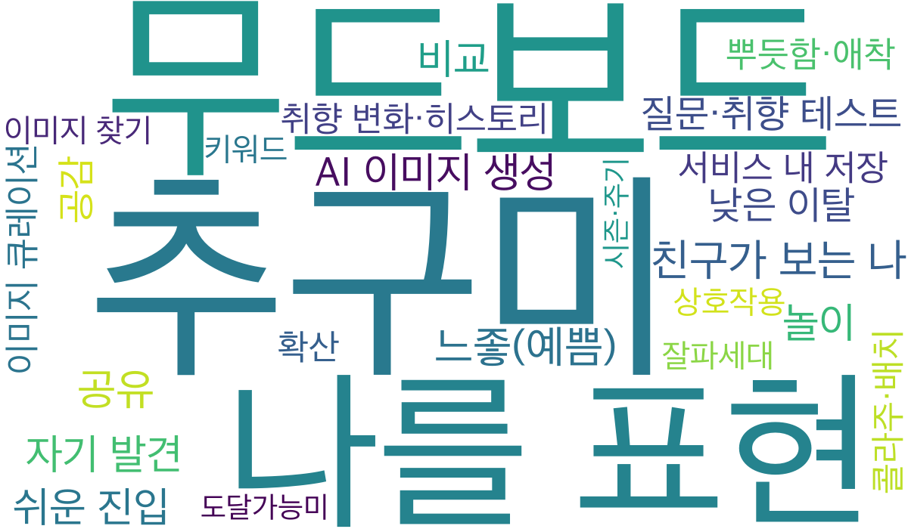
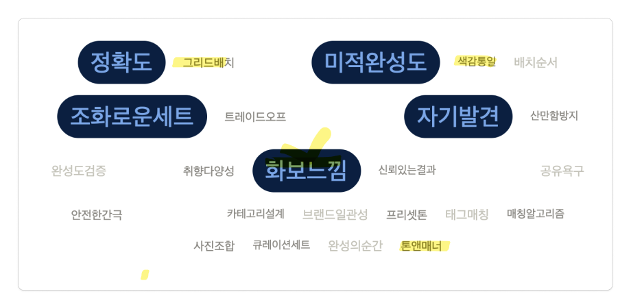

# Step 08. 워드클라우드 만들기

> 목적: 지금까지의 논의를 시각화하여 **나의 생각 → 우리의 생각**으로 맞춘다.

> **Guide:**  
> 1. Agent가 `docs/04`~`07`을 읽고 **키워드·가중치** 표를 채운다.  
> 2. `docs/08_word_cloud.md`의 bash 가이드대로 워드클라우드 이미지를 생성한다.  
> 3. 생성된 이미지를 보며 팀이 중요도를 이야기하고, 가중치를 조정한다. (필요하면 2~3을 반복)

**프롬프트 예시**

```
docs/04~07을 읽고 docs/08_word_cloud.md를 채워줘.
키워드(가중치) 표만 채워줘. 가중치는 1~10 정수로, 중요할수록 크게.
구조와 상단 Guide는 유지하고, 본문 표만 채워줘.
```

## 키워드(가중치)

> `docs/04`~`07`에서 추출한 키워드. 가중치가 클수록 워드클라우드에서 크게 표시된다.

| 키워드 | 가중치 |
|---|---|
| 추구미 | 10 |
| 무드보드 | 10 |
| 나를 표현 | 9 |
| 친구가 보는 나 | 9 |
| 공유 | 9 |
| 느좋(예쁨) | 9 |
| 자기 발견 | 8 |
| 놀이 | 8 |
| 쉬운 진입 | 8 |
| 비교 | 8 |
| AI 이미지 생성 | 8 |
| 질문·취향 테스트 | 7 |
| 공감 | 7 |
| 낮은 이탈 | 7 |
| 뿌듯함·애착 | 6 |
| 이미지 큐레이션 | 6 |
| 서비스 내 저장 | 6 |
| 취향 변화·히스토리 | 6 |
| 확산 | 6 |
| 콜라주·배치 | 6 |
| 이미지 찾기 | 5 |
| 키워드 | 5 |
| 상호작용 | 5 |
| 잘파세대 | 5 |
| 도달가능미 | 4 |
| 시즌·주기 | 4 |

## 워드클라우드

```bash
# 의존성 설치
python3 -m venv .venv
source .venv/bin/activate
pip install -r requirements.txt

# 워드클라우드 이미지 생성
source .venv/bin/activate
python scripts/generate_word_cloud.py
```

**Agent 지시 프롬프트**

```
docs/08_word_cloud.md의 bash 가이드를 참고해서 의존성을 설치하고, scripts/generate_word_cloud.py로 docs/assets/word_cloud.png를 생성해줘.
완료되면 생성된 파일 경로와 포함된 키워드 개수를 알려줘.
```



## 워드클라우드 (류하)

> 류하가 만든 워드클라우드.


